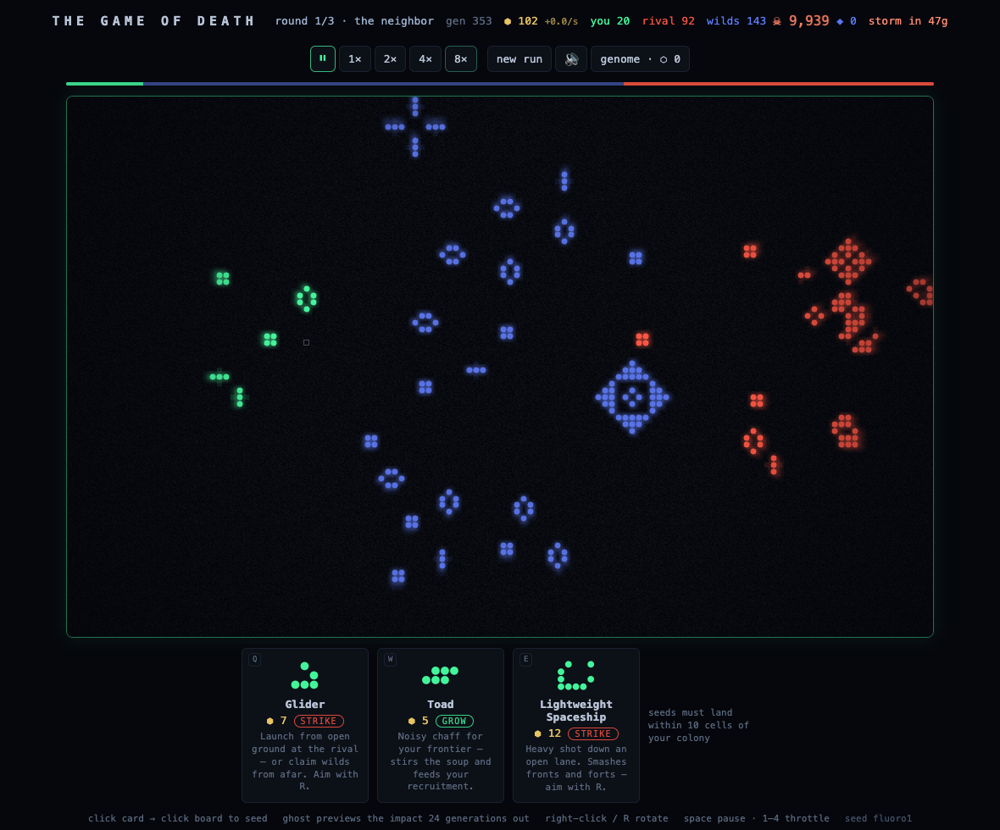

# THE GAME OF DEATH

A roguelike duel built on Conway's Game of Life. Seed your colony, open the
throttle, and outlive both the rival and the entropy storm closing in from the
edges of the universe.

**Play:** `npm install && npm run dev` → http://localhost:5173



## How it plays

Two colonies of B3/S23 life share one board with the **Free Radicals**
between them — an unaligned third faction of unstable debris holding the
midfield. They answer to no one, they get in the way of your shots, and they
join whoever flanks them hardest: cover, obstacles, and recruits, all at
once. On top of Conway's rules sit three faction interactions:

- **Recruitment** — a newborn cell joins the strictly dominant neighboring
  faction (ties abort the birth).
- **Flanking** — a live cell whose enemy neighbors outnumber its friends by 2+
  defects on the spot. Overwhelming force assimilates — this is also how you
  recruit the Free Radicals to your cause.
- **Casualties** — outnumbered by just 1, the cell dies instead. Skirmish
  fronts bleed and churn rather than feeding the winner.

You interact through three levers:

- **The throttle** (pause–8×). Biomass income accrues *per generation*, so
  running hot is how you get rich — and how you die unwatched.
- **The hand.** Three pattern cards (gliders, eaters, spaceships, the
  R-Pentomino…) placeable within 10 cells of your living colony. Travelers
  need open ground to launch — ash corrupts them. Right-click or `R` rotates;
  travelers auto-aim at the rival on select. Plan while paused; pay in biomass.
- **Foresight.** The placement ghost double-simulates the next 24 generations
  and shows the *causal impact* of the placement you're hovering — cells you'd
  gain in teal, enemy futures you'd disrupt in red. Every card visibly does
  something different before you pay for it.
- **The storm.** After 400 generations the board edges begin to die inward.
  Extinction ends the duel; if the storm closes first, territory decides — and
  the house wins ties.

Runs are fully deterministic per seed (`?seed=...` in the URL). Same seed, same
actions, same universe, every time.

## The gauntlet

A run is three rounds against an escalating rival — **the neighbor** (vanilla),
**the veteran** (Hardy gene, sharper planner), **elder blood** (Hardy +
Vampire, sharpest planner). Rounds are data (`rounds.ts`): a rival loadout
plus planner settings. Clear all three and the universe yields (+40 bonus
ash); die anywhere and the run records how far you got. Each finished round
pays ash either way.

## The genome (meta-progression)

Finished runs pay **ash** (survival time + victory bonus + final holdings).
Ash buys two things, both breadth rather than raw power:

- **Genome slots** (max 5, rising cost). Your first run is pure B3/S23 — the
  game teaches Conway before it lets you mutate him.
- **Genes**, equipped into slots pre-run; the loadout is your build:
  - *rule genes* mutate one axis — Hardy (S+4), HighLife (B+6), Ranger
    (reach 14), Thrifty (income +50%)
  - *card genes* unlock **special uni-cells** into your draw pool:
    - **Elder** — a single immortal cell; ignores every death rule but the storm
    - **Vampire** — converts one adjacent enemy per generation, never defects,
      starves without neighbors (a non-standard death)
    - **Martyr** — lives like a cell, dies like a bomb: adjacent enemies die too

Special cells are per-cell *type* overrides in the engine (`celltypes.ts`) —
data tuples the step function reads, never bespoke logic. Meta state lives in
localStorage on the web side; the sim receives the loadout as an argument and
stays pure.

## The proof

`npm run harness` pits a **planner** policy (samples placements, scores each
with the same Foresight projection the player sees, plays the best) against a
**random** policy over seeded duels, with act order alternated to remove
first-mover bias. Current result at n=48 per matchup:

```
planner vs random    71% player wins
random  vs random    38% player wins   ← structural baseline (ties favor rival)
planner vs planner   56% player wins

core-mechanics proof: planning is worth +33 points of winrate over random play
```

The +33-point edge over the shared baseline (~3σ) is the game's core claim,
stated as a number: under these mechanics, better planning reliably wins.

`npm run balance` sweeps every gene in a **paired design** — the same seed set
replayed with and without each gene, so deltas are attributable to the gene
and not to seed luck. Current table (n=16 per gene, vs 38% same-seed
baseline):

```
hardy +19 · highlife +25 · ranger +0 · thrifty −6 (borderline)
elder +19 · vampire +19 · martyr +0
```

The sweep earned its keep immediately: it caught Hardy's original S+4 at a
100% winrate (the Maze-rule carpet), caught economy genes leaking to both
factions through shared tuning, and unmasked the Vampire at +50 once the
paired design removed seed confounding.

With gene LEVELS, the sweep tests all 22 rungs. Findings and policy:

- Card-gene ladders have the ideal shape (martyr 42→58→67%): each rung a
  real step, top rung hot but honest.
- Rule-digit ladders escalate to jackpot tier (hardy@3 measured 100%).
  Deliberate design response: **price, don't flatten** — in a single-player
  roguelite, breaking the game is the earned fantasy. Top rungs cost
  130–170 ash (several full runs); the rival fields the same genes in
  later rounds.
- Ranger/Thrifty read flat to the planner (it hoards and under-reaches);
  the sampler is now reach-aware so Ranger participates. Their real value
  is human tempo and options — known policy blindness.

## Architecture & the long-term stack

```
src/sim/      Pure, deterministic, dependency-free TypeScript.
              No DOM, no Date.now, no Math.random. Nothing in here may
              import outward.
src/web/      Vite + React chrome. The board is ONE canvas, never React.
src/harness/  Headless proof + balance harnesses; the gene sweep fans out
              across CPU cores (a full 22-rung audit runs in ~2 minutes).
```

**This is the long-term stack: TypeScript end-to-end.** The sim sits behind
a narrow boundary that was designed as a future Rust/WASM seam, and the
decision is to *keep the door open, not walk through it*: the browser runs
10k cells at 60fps with headroom to quadruple, and harness throughput —
the one trigger that fired — is answered by process-parallel sweeps at a
tenth of the complexity a second language would add. Revisit Rust/WASM
only if: boards grow past ~500×500, per-cell rule fields land, or sweep
confidence needs another order of magnitude. The port stays mechanical:
`engine.ts` is ~250 stable lines with 27 ground-truth tests and exact
determinism hashes to verify any reimplementation against.

**Mobile & offline** (orthogonal to the language question): the game is a
PWA — every asset is local and precached by a service worker, so it is
fully playable offline and installable to a phone's home screen from the
browser. For app-store distribution, Capacitor wraps this exact build in a
native shell with no code changes. Rust/WASM would still run inside the
same WebView on mobile — it buys nothing on this axis; only a from-scratch
native renderer (e.g. Bevy) would, and the pure sim core keeps that door
open too.

## Design laws

1. **One currency, one physics.** All power flows through biomass; abilities
   transform matter, never mint it.
2. **Carrying capacity as ecology.** Runaway growth gets taxed by the rules
   themselves, not by UI caps. (Planned — see roadmap.)
3. **Genes are data, not code.** Every upgrade is a rule tuple (B/S digits,
   radius, delay, cost). Never bespoke logic.
4. **One axis per gene.** Each gene changes exactly one number, so broken
   builds are bisectable.
5. **Every forever has a clock.** No board state may stop changing; the storm
   is the global guarantee.
6. **Determinism with seeds.** Every run is a replayable bug report.

## Roadmap

- **M1 — the toy** *(this build)*: board, factions, throttle, hand, biomass,
  storm, scripted rival, win/loss.
- **M2 — the kill-question**: does the better plan reliably win? Tune faction
  physics + AI until self-play says yes; add Foresight ghost-preview.
- **M3 — the loop**: 3-round gauntlet, between-round shop, five archetype
  keystone genes, harness flags >65% winrates.
- **Later**: meta-progression (breadth-first unlocks, genome slots, codex),
  Rust/WASM sim port behind the existing boundary, PWA + touch + juice.

## Commands

| Command             | What                                        |
| ------------------- | ------------------------------------------- |
| `npm run dev`       | Dev server                                  |
| `npm test`          | Sim ground-truth tests (vitest)             |
| `npm run harness`   | Policy-matchup proof + determinism audit    |
| `npm run balance`   | Gene balance sweep (flags <35% / >65% winrates) |
| `npm run typecheck` | Strict TS across sim/web/harness            |
| `npm run build`     | Static production build (itch.io-shippable) |
