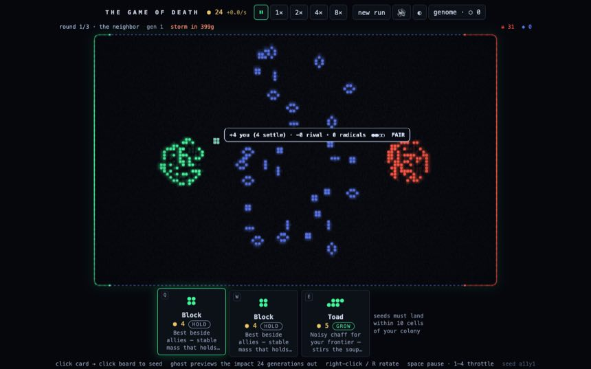
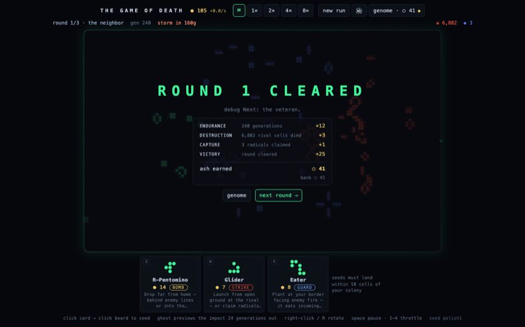
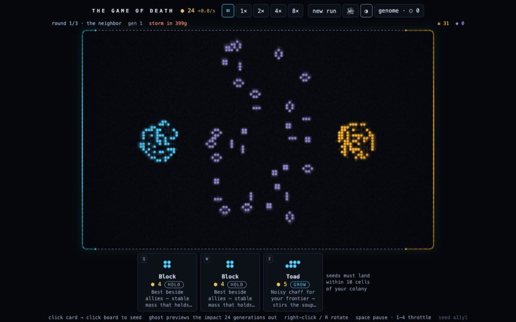

# THE GAME OF DEATH — Layout Polish Brief

**For:** the design pass on the existing UI · **From:** the build session · **Status:** current as of commit `b910e84`
**Repo:** `github.com/SBRoberts/game-of-death` (private) · run locally with `npm install && npm run dev`

---

## The assignment

Polish the **layout and visual composition** of an existing, working game UI to a best-in-class standard. This is a refinement pass on a screen that already fits one viewport and already has a design language — not a redesign of mechanics, information architecture, or the game's fiction. Your output will be implemented by an engineering session working from your spec, so precision beats prose.

**Explicitly in scope:** spatial composition, hierarchy, alignment, rhythm, the chrome around the board, the modal and overlay surfaces, typography refinement within the existing family, micro-layout of cards and bars.
**Explicitly out of scope:** game rules, the canvas simulation's internals, new features, renaming things, the a11y guarantees (they are a floor, not a suggestion).

### How to use this brief

1. Read *The world* and *Principles in force* — these are binding; everything you propose should feel inevitable within them.
2. *Token inventory* and *Anatomy* describe what exists. Treat tokens as your vocabulary; extend it rather than bypassing it.
3. *Friction log* lists observed problems. **They are symptoms, deliberately unaccompanied by solutions — diagnosis and treatment are your job.**
4. Check every idea against *Hard constraints* and *Success criteria* before it goes in the punch list.

---

## The world

A roguelike duel built on Conway's Game of Life, rendered as a **fluorescence microscopy slide**: glowing stained colonies on dark glass, film grain, vignette, phosphor bloom. You (GFP green, from the left) fight a rival colony (mCherry red, from the right) across a midfield held by the Free Radicals (DAPI blue, unaligned). An entropy storm closes from the edges. Rounds end in a Balatro-style itemized cash-out; ash buys genome upgrades between runs.

**Tone words:** clinical elegance · specimen under glass · phosphor · deliberate · tactile (Balatro is the touchstone for how interactions should *feel*) · quietly ominous.

**The player's loop:** pause → select a card (Q/W/E) → aim on the board (foresight tooltip evaluates the spot) → click to seed → release time (space) → watch the cascade. The screen must serve fast alternation between *planning* (reading, deciding) and *watching* (spectacle, momentum).

## Principles in force (binding)

1. **The board is the protagonist.** Every pixel of chrome must justify taking space from the specimen. Chrome recedes; the slide glows.
2. **UI belongs in the world.** The best precedent already shipped: the population bar was dissolved into the board's *border* — the momentum frame (green arc grows from the left edge's center, red from the right, slate radical seams between). When data can live in the fiction, it should. When it can't, it should at least dress like the instrument panel of a microscope, not a web app.
3. **Legibility is a mechanic.** The foresight tooltip, settle-counts, and rejection reasons are gameplay. Nothing may reduce their prominence; treatments that increase their authority are welcome.
4. **Fluorophores are the palette.** Color = faction = meaning. Decorative color is spent only where it encodes something.
5. **Two stains, one design.** Every proposal must work identically in the GFP/mCherry palette and the CFP/YFP colorblind-safe palette (toggleable, persisted). If a treatment only works in one stain, it's wrong.

---

## Token inventory (current)

### Color — stain GFP (default)

| Token | Value | Role |
|---|---|---|
| `--bg` | `#05070c` | page ground (near-black, blue bias) |
| board bg | `#04060b` | slide glass (canvas-drawn) |
| `--panel` | `#0c1017` | chrome surfaces (buttons, cards, modals) |
| `--line` | `#232c3e` | hairlines, borders |
| `--text` | `#c3cfe0` | primary text |
| `--dim` | `#8391a8` | secondary text (AA on bg — do not darken) |
| `--you` | `#42f59b` | player / GFP green |
| `--rival` | `#ff5340` | rival / mCherry red |
| `--dapi` | `#7f96ff` | radicals / DAPI blue |
| `--gold` | `#e8c463` | biomass, ash, martyr, rewards |
| vampire | `#c46bff` | far-red fluorophore (special cell) |
| elder | `#eafcff` | white-hot core |

### Color — stain CFP (colorblind-safe; same roles)

you `rgb(80,205,255)` cyan · rival `rgb(255,178,46)` amber · radicals `rgb(158,145,224)` lavender. Applied at runtime through CSS vars + a canvas palette system (`setPalette()` in `src/web/render.ts`); anything you spec in tokens inherits both stains for free.

### Type

One family by design: `ui-monospace, 'SF Mono', Menlo, Consolas, monospace` — the instrument-readout voice. Scale: base 14px · subbar/labels 13px · card tips 12px · chips/keys 11px · title 13px with `letter-spacing: .32em`. Digits use `tabular-nums` where they align. **You may re-cut the scale and spacing; a second family is permitted only if self-hosted (no CDNs — strict CSP) and only if it earns its place in the fiction.**

### Space, shape, motion

- Radii: 6 (buttons) / 8 (cards, panels) / 10 (board). Gaps: 8 within groups, 16 between.
- The app is a single column, centered, `height: 100vh; overflow: hidden` — everything fits one screen ≥ 800px tall.
- Motion vocabulary: deal-in 320ms `cubic-bezier(.2,1.2,.4,1)` · verdict slam 600ms · cash-out rows 240ms stagger · card 3D tilt on hover · screen shake 260ms on detonations · momentum frame eases at 0.06/frame. All of it is disabled under `prefers-reduced-motion` — keep it that way.
- Sound exists (synthesized per-piece placement sounds, booms, ticks) — visual feedback never carries meaning alone.

---

## Anatomy of the current layout

```
┌──────────────────────────────────────────────────────────────┐
│ HEADER  title · ⬢ biomass +rate · [⏸ 1× 2× 4× 8×] ·          │  ~34px
│         [new run] [🔊] [◐] [genome · ⬡ ash]                   │
├──────────────────────────────────────────────────────────────┤
│ SUBBAR  round 1/3 · label   gen N   storm in Ng   ····spacer │  ~20px
│         ····································  ☠ kills ◈ caps │
├──────────────────────────────────────────────────────────────┤
│                                                              │
│   BOARD  <canvas> 128×80 cells, momentum frame as border,    │  fills
│          coach bar (first run), verdict overlay + cash-out   │  remainder
│          on round end. Foresight tooltip drawn ON canvas     │  (~548px
│          beside the cursor.                                  │  @800px)
│                                                              │
├──────────────────────────────────────────────────────────────┤
│ HAND    [Q card] [W card] [E card]  ·  placement-radius note │  ~170px
├──────────────────────────────────────────────────────────────┤
│ HELP    click card → seed · ghost previews · R rotate · ...  │  ~18px
└──────────────────────────────────────────────────────────────┘
```

Region owners: layout + chrome in `src/web/styles.css` and `src/web/App.tsx` (JSX regions in order: header → subbar → board-wrap → Hand → sr-live → help). Canvas-drawn UI (frame, tooltip, coach positioning target, overlays' backdrop) in `src/web/render.ts`. Cards in `src/web/Hand.tsx`. Modal in `src/web/Genome.tsx`. Cash-out rows in `src/web/CashOut.tsx`.

### Current state — live duel (GFP stain), with the foresight tooltip:



### Round end — verdict + cash-out over the dimmed slide:



### The CFP stain (same layout, colorblind-safe fluorophores):



---

## Friction log — problems, not solutions

Observed in playtests and reviews. Diagnose freely; treat as you see fit.

1. **The header reads as a browser toolbar, not an instrument.** A row of similar rounded buttons: throttle, an emoji mute, the palette toggle, and the genome wallet all carry equal visual weight regardless of how often they're touched mid-run.
2. **The subbar floats.** Round/gen/storm on the left, kill/capture tickers pushed right by a spacer — the grouping is arbitrary and the line feels unanchored, neither part of the header nor of the board.
3. **The hand outshines the board.** Three bright-bordered panels with large previews and three lines of tip text each — at rest they demand more attention than the specimen. Selected-state vs. rest-state contrast is small.
4. **The placement-radius note is an orphan.** A lone text block to the right of the cards, ragged against nothing.
5. **The verdict/cash-out surface is functionally right, visually plain.** A dark rounded panel over a dimmed board — the drama of the moment (frame sweeping green/red, verdict type slamming in) deserves a stage, and the ledger deserves the tactility of the rest of the game.
6. **The genome modal is a utility screen in a game with a fiction.** Grid of gray cards, gray pips, plain buttons — it's where players spend their hard-won ash, and it feels like a settings page.
7. **Hierarchy at glance distance is untested.** In watching mode the eye needs: am I winning (frame — good), how rich am I (header left), what's incoming (storm timer, subbar). Wallet and storm sit at opposite corners from where the action is.
8. **Wide viewports waste the wings.** At 1440+ the column centers with large empty margins while the subbar/hand stay pinned to the board width. Nothing *breaks*; nothing *uses* it either.
9. **The coach bar and help footer are generic.** System-default-feeling strips in a game whose every other surface has a voice.
10. **The title is a label, not a mark.** `THE GAME OF DEATH` in spaced caps does honest work; it has no relationship to the specimen, the stain, or the glow.

---

## Hard constraints

- **One `<canvas>` is the game.** All cell rendering stays canvas; React/DOM never draws board content. Canvas-adjacent UI may be drawn *in* the canvas (the tooltip and frame already are) or positioned over it.
- **One viewport, no scroll**, at ≥ 800px tall / ≥ 1024px wide. The board must never get smaller than it is today at 1280×800 (548px tall) — net-larger is a win.
- **A11y is a floor:** AA contrast everywhere, `:focus-visible` ring, ARIA labels/pressed states, live-region announcements, `prefers-reduced-motion` support, both stains. Any proposal that dips below current accessibility is rejected regardless of beauty.
- **Hotkey affordances stay visible** (Q/W/E on cards, keys on throttle) — the keyboard loop is core feel.
- **Performance:** no per-frame DOM mutation, no CSS filters/backdrop-blur over the live canvas, nothing that costs frames at 30 gen/s.
- **Static PWA:** no external assets of any kind (fonts, images, scripts). Self-contained or nothing.
- **Implementation currency is CSS custom properties + the existing component structure.** Token-level changes are cheap; structural JSX changes are affordable; new dependencies are not available.

## Success criteria

- **The three-glance test:** from watching mode, a stranger answers *am I winning? / what can I afford? / how long until the storm?* — each in under a second, eyes barely leaving the board.
- **The squint test:** blurred, the screen ranks board ≫ hand > verdict moments > wallet > everything else.
- **The store-page test:** an unstaged screenshot of a mid-battle moment looks like a shipped game someone would wishlist.
- **Stain parity:** every screenshot criterion passes in both palettes, at 1280×800 and 1440×900.
- **No regressions:** the a11y checklist above, the one-viewport rule, and 60fps hold.

## Deliverables

1. **A prioritized punch list** — each item: the region, the change, effort tag (S = token/CSS-only, M = structural), and which friction item(s) it treats.
2. **A token-level spec** for every S item: exact values (colors as hex, sizes in px, easings written out), diffed against the inventory above.
3. **Region notes** for every M item: what moves where and why, referencing the anatomy diagram — prose + ASCII is fine, code is not required.
4. **At most two bold moves**, flagged separately with rationale. This is a polish pass; if everything is bold, nothing ships.
5. Where you exercise a granted freedom (below), say so explicitly.

### Freedoms granted

You may: re-cut the type scale · restyle any chrome surface · reposition anything outside the canvas · restructure the hand's card anatomy · give the title a mark treatment · use the wings at wide viewports · propose canvas-drawn UI for the engineering session to implement (pattern exists) · redesign the genome modal wholesale (it's the one region where "polish" may mean "rethink").

You may not: touch sim logic, timings of gameplay, or wording of mechanics · add dependencies or external assets · trade away board size, a11y, or either stain.

---

*Everything here is current, real, and shipped — no lorem anywhere in the game. When in doubt, open the repo and run it; the seed `?seed=brief` gives you a reproducible board. Questions that block you are design decisions you're empowered to make; document them as such.*
